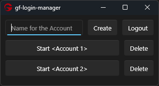
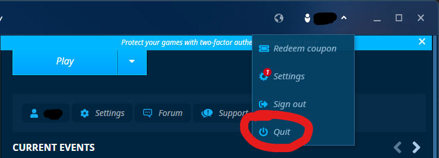
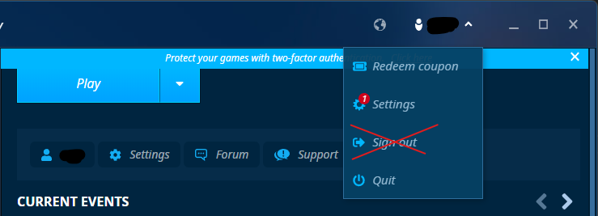

# Gameforge Multi Account Login Manager
This is a login manager made for the Gameforge Client, it can be used to easily switch between Accounts without the need to log them in each time.

# How to use
## Adding Accounts
Log in normally into your Gameforge Account, in the Gameforge Client use Quit (not always needed but sometimes it doesn't write the Session to disk otherwise), choose a name for the Account and click **Create**

To Add more Accounts logout of the Account using the Logout Button in the Login Manager **(never the Gameforge Client As this invalidates the Session)** and then repeat the first Step

To Login just click on Start, in case this brings you to the GF Login Screen the Session was probably invalidated (e.g. used Sign out in GF client or changed password) and you need to Delete the Account and add it again.

Some times when you start your client it might happen that you get the red bar, this happens if you click play to fast after logging in, it generally goes away if you click play again.